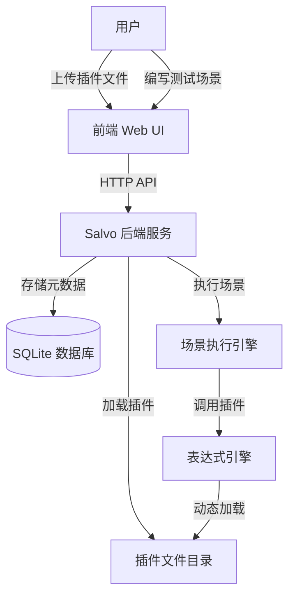
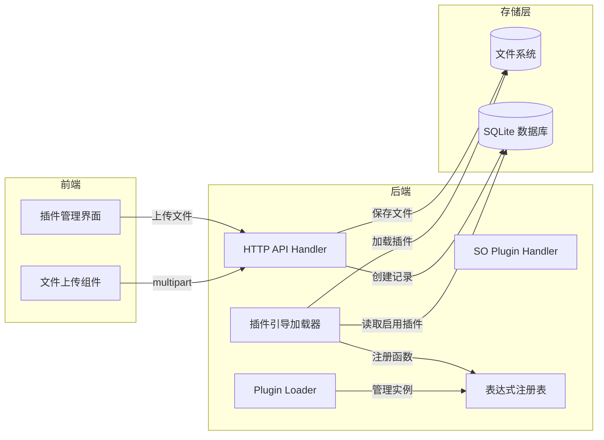
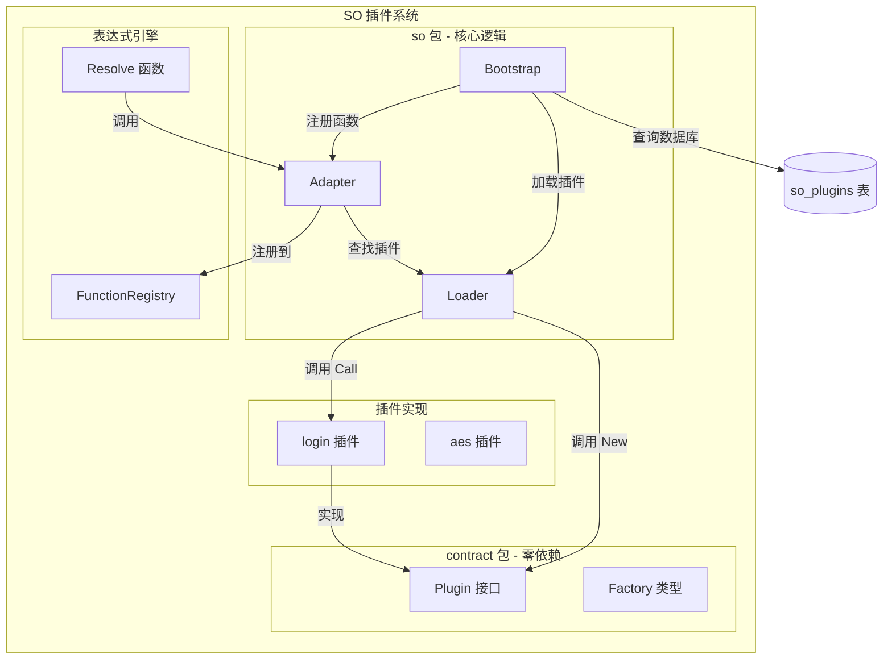
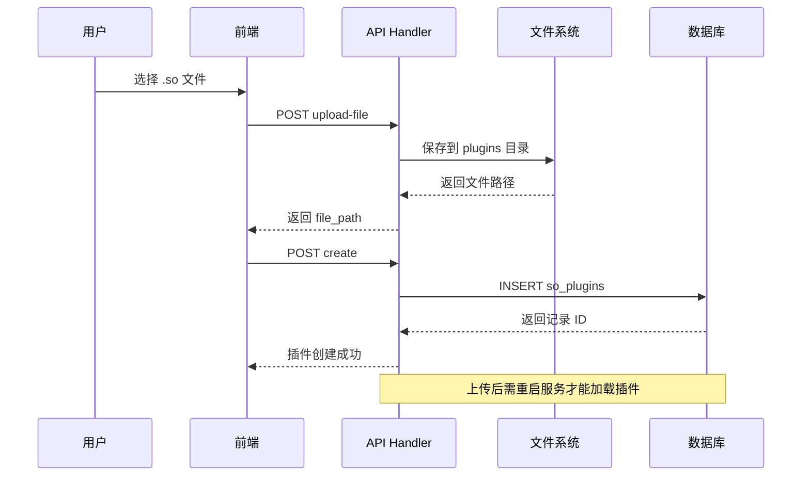
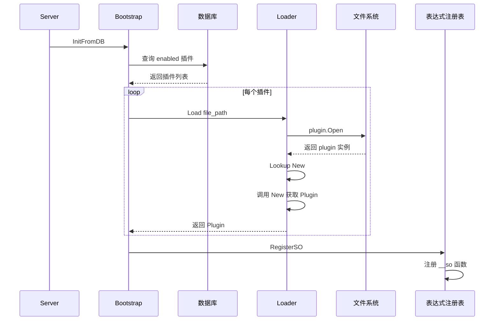
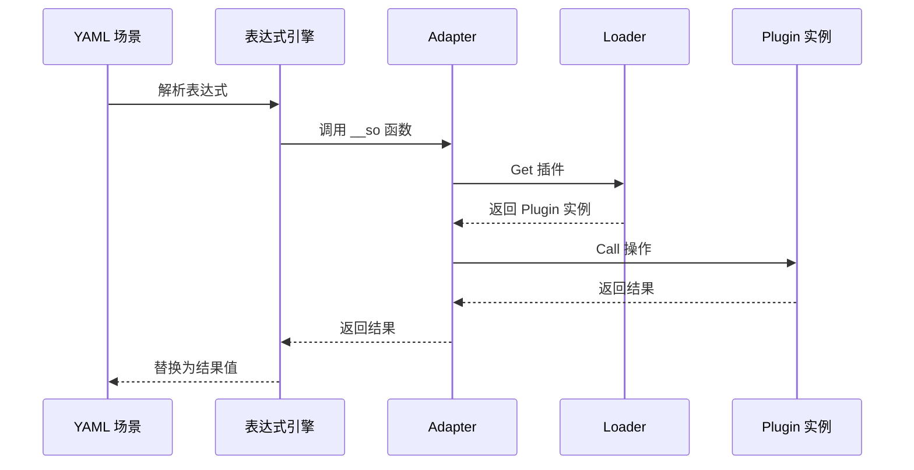

# SO 插件系统架构文档

## 概述

SO 插件系统是 Salvo 的动态扩展机制，允许通过 Go 共享库（`.so` 文件）在运行时加载自定义功能。插件通过表达式引擎的 `__so()` 函数在场景测试中被调用。

---

## C4 模型

### Level 1: System Context（系统上下文）



**说明**：
- 用户通过前端上传 `.so` 插件文件并管理插件状态
- 后端将文件保存到 `plugins/` 目录，元数据存入数据库
- 服务启动时从数据库读取插件列表并动态加载
- 场景执行时通过表达式引擎调用插件功能

---

### Level 2: Container（容器）



**说明**：
- **前端**：提供插件上传、列表、启用/禁用界面
- **后端 API**：处理文件上传和元数据管理
- **Bootstrap**：服务启动时加载所有启用的插件
- **Loader**：管理已加载的插件实例，支持版本化
- **存储**：`.so` 文件存文件系统，元数据存数据库

---

### Level 3: Component（组件）



**说明**：
- **contract 包**：定义 `Plugin` 接口和 `Factory` 类型，零外部依赖，确保插件与主程序二进制兼容
- **Loader**：管理插件实例，支持按名称和版本查找
- **Adapter**：将 `__so` 函数注册到表达式引擎，参数格式：`__so("pluginName", "op", "arg1", ...)`
- **Bootstrap**：服务启动时从数据库加载所有启用状态的插件

---

### Level 4: Code（代码）

#### 4.1 数据库表结构

```sql
CREATE TABLE so_plugins (
    id         INTEGER PRIMARY KEY AUTOINCREMENT,
    name       TEXT NOT NULL,
    version    TEXT NOT NULL,
    file_path  TEXT NOT NULL,
    status     TEXT NOT NULL DEFAULT 'enabled',
    config     TEXT,
    created_at DATETIME DEFAULT CURRENT_TIMESTAMP,
    updated_at DATETIME DEFAULT CURRENT_TIMESTAMP,
    deleted_at DATETIME
);
```

**字段说明**：

| 字段 | 类型 | 说明 | 示例 |
|------|------|------|------|
| `id` | INTEGER | 主键，自增 | `328438838949056512` |
| `name` | TEXT | 插件名称（唯一标识） | `"login"` |
| `version` | TEXT | 语义化版本号 | `"1.0.0"` |
| `file_path` | TEXT | `.so` 文件相对路径 | `"plugins/login.so"` |
| `status` | TEXT | 启用状态 | `"enabled"` / `"disabled"` |
| `config` | TEXT | JSON 配置（可选） | `'{"timeout": 30}'` |
| `created_at` | DATETIME | 创建时间 | `2026-06-25 15:09:00` |
| `updated_at` | DATETIME | 更新时间 | `2026-06-25 15:09:00` |
| `deleted_at` | DATETIME | 软删除时间戳 | `NULL` |

---

#### 4.2 插件接口定义

```go
// internal/plugin/so/contract/contract.go
package contract

// Plugin 是每个 SO 插件必须实现的接口
type Plugin interface {
    Name() string                                    // 返回插件名称
    Version() string                                 // 返回版本号
    Call(op string, args []string) (string, error)   // 执行操作
}

// Factory 是 .so 文件必须导出的 New 函数签名
type Factory func() (Plugin, error)
```

---

#### 4.3 插件实现示例

```go
// plugins/login/main.go
package main

import (
    "github.com/yannick2025-tech/Salvo/internal/plugin/so/contract"
)

type loginPlugin struct{}

func (p *loginPlugin) Name() string    { return "login" }
func (p *loginPlugin) Version() string { return "1.0.0" }

func (p *loginPlugin) Call(op string, args []string) (string, error) {
    switch op {
    case "login":
        return p.login(args)  // 完整登录流程
    case "get_salt":
        return p.getSalt(args)
    default:
        return "", fmt.Errorf("unknown operation: %s", op)
    }
}

// New 是导出的工厂函数，供 Loader 调用
func New() (contract.Plugin, error) {
    return &loginPlugin{}, nil
}
```

---

#### 4.4 表达式调用语法

```yaml
# 场景 YAML 配置
nodes:
  - name: 获取 JWT Token
    type: generator
    config:
      expression: "${__so('login', 'login', '${salt_url}', '${login_url}', '${user}', '${pass}')}"
      variable: jwt_token
```

**参数说明**：
- 第 1 个参数：插件名称（如 `"login"`）
- 第 2 个参数：操作名称（如 `"login"`、`"get_salt"`）
- 后续参数：传递给操作的参数列表

---

## 数据流

### 上传流程



---

### 启动加载流程



---

### 运行时调用流程



---

## 关键约束

### 1. 二进制兼容性

**问题**：Go 的 plugin 机制要求 `.so` 文件和主程序必须链接**完全相同版本**的所有共享包。

**解决方案**：
- 将 `Plugin` 接口提取到 `internal/plugin/so/contract` 包
- `contract` 包零外部依赖，只包含接口定义
- 插件只导入 `contract` 包，不导入 `so` 包（避免依赖链污染）

```
错误做法：插件导入 internal/plugin/so
  -> so 包依赖 internal/store/model/repo
  -> 导致版本不兼容

正确做法：插件导入 internal/plugin/so/contract
  -> contract 包零依赖
  -> 确保二进制兼容
```

### 2. 文件路径一致性

**数据库存储**：`file_path` 字段存储相对路径，如 `plugins/login.so`

**实际位置**：`.so` 文件必须存在于 `plugins/` 目录下

**构建输出**：Makefile 统一输出到 `plugins/<name>.so`

```makefile
# Makefile
plugins-build:
    go build -buildmode=plugin -o plugins/$$name.so $$dir/main.go
```

### 3. 表达式语法

**支持的引号**：单引号和双引号均可

```yaml
# 以下两种写法都正确
expression: "${__so('login', 'login', 'arg1')}"
expression: '${__so("login", "login", "arg1")}'
```

**注意事项**：
- 参数中的逗号会被解析为参数分隔符
- 如果参数本身包含逗号，需要用引号包裹

---

## 故障排查

### 问题 1：插件加载失败 - "plugin was built with a different version"

**原因**：`.so` 文件和主程序使用了不同版本的共享包

**常见场景**：使用 `go run` 运行主程序，而插件用 `go build` 编译。`go run` 和 `go build` 使用不同的 build cache key，导致共享包版本不一致。

**解决**：
```bash
# 使用 build-all 确保插件和主程序在同一编译会话中构建
make build-all
make restart
```

### 问题 2：插件未找到 - "plugin not found"

**可能原因**：
1. 插件未在数据库中注册为 `enabled` 状态
2. `file_path` 路径与实际文件位置不匹配
3. 服务启动后上传的插件需要重启才能加载

**排查步骤**：
```bash
# 1. 检查数据库记录
sqlite3 salvo.db "SELECT name, version, file_path, status FROM so_plugins;"

# 2. 检查文件是否存在
ls -la plugins/*.so

# 3. 查看启动日志
grep "so-bootstrap" logs/salvo.log
```

### 问题 3：表达式解析失败

**症状**：日志显示 `expression engine resolve failed`

**原因**：单引号/双引号混用或参数格式错误

**解决**：检查 YAML 中的表达式语法，确保引号匹配

---

## 开发新插件

### 步骤 1：创建插件目录

```bash
mkdir -p plugins/my-plugin
```

### 步骤 2：编写 main.go

```go
package main

import (
    "fmt"
    "github.com/yannick2025-tech/Salvo/internal/plugin/so/contract"
)

type myPlugin struct{}

func (p *myPlugin) Name() string    { return "my-plugin" }
func (p *myPlugin) Version() string { return "1.0.0" }

func (p *myPlugin) Call(op string, args []string) (string, error) {
    switch op {
    case "hello":
        return fmt.Sprintf("Hello, %s!", args[0]), nil
    default:
        return "", fmt.Errorf("unknown operation: %s", op)
    }
}

func New() (contract.Plugin, error) {
    return &myPlugin{}, nil
}
```

### 步骤 3：构建插件

```bash
go build -buildmode=plugin -o plugins/my-plugin.so plugins/my-plugin/main.go
```

### 步骤 4：上传并注册

通过前端 UI 或 API 上传 `.so` 文件并创建插件记录。

### 步骤 5：在场景中使用

```yaml
nodes:
  - name: 调用我的插件
    type: generator
    config:
      expression: "${__so('my-plugin', 'hello', 'World')}"
      variable: greeting
```

---

## 总结

SO 插件系统通过以下机制实现动态扩展：

1. **文件存储**：`.so` 文件存放在 `plugins/` 目录
2. **元数据管理**：数据库记录插件名称、版本、路径、状态
3. **动态加载**：服务启动时通过 `plugin.Open()` 加载启用的插件
4. **表达式集成**：通过 `__so()` 函数在场景测试中调用插件
5. **二进制兼容**：使用零依赖的 `contract` 包确保插件与主程序兼容

**关键文件**：
- `internal/plugin/so/contract/contract.go` - 插件接口定义
- `internal/plugin/so/loader.go` - 插件加载器
- `internal/plugin/so/bootstrap.go` - 启动引导
- `internal/plugin/so/adapter.go` - 表达式引擎适配
- `internal/api/so_handler.go` - HTTP API 处理
- `plugins/*/main.go` - 插件实现
