# Git Commit 统计报告

生成日期：2026-09-07

## 概览

| 指标 | 数值 |
|------|------|
| 总提交数 | 211 |
| Bug 修复数 | 80 |
| Bug 修复占比 | 37.9% |
| 首次提交 | 2026-05-01 |
| 最近提交 | 2026-09-07 |
| 活跃天数 | 54 天 |

## 按日期统计

| 日期 | 提交次数 |
|------|----------|
| 2026-05-01 | 11 |
| 2026-05-02 | 19 |
| 2026-05-03 | 10 |
| 2026-05-04 | 1 |
| 2026-05-05 | 3 |
| 2026-05-06 | 1 |
| 2026-05-07 | 3 |
| 2026-05-09 | 1 |
| 2026-05-11 | 1 |
| 2026-05-12 | 3 |
| 2026-05-15 | 1 |
| 2026-05-17 | 1 |
| 2026-05-19 | 2 |
| 2026-05-23 | 5 |
| 2026-05-24 | 2 |
| 2026-05-25 | 3 |
| 2026-05-26 | 1 |
| 2026-05-27 | 1 |
| 2026-05-29 | 1 |
| 2026-06-11 | 3 |
| 2026-06-13 | 1 |
| 2026-06-16 | 2 |
| 2026-06-17 | 12 |
| 2026-06-19 | 3 |
| 2026-06-21 | 3 |
| 2026-06-26 | 1 |
| 2026-06-28 | 5 |
| 2026-06-29 | 8 |
| 2026-06-30 | 4 |
| 2026-07-01 | 9 |
| 2026-07-02 | 4 |
| 2026-07-03 | 6 |
| 2026-07-06 | 2 |
| 2026-07-07 | 4 |
| 2026-07-16 | 2 |
| 2026-07-17 | 2 |
| 2026-07-18 | 3 |
| 2026-07-20 | 4 |
| 2026-07-21 | 4 |
| 2026-07-22 | 8 |
| 2026-07-23 | 3 |
| 2026-07-24 | 1 |
| 2026-07-30 | 1 |
| 2026-08-01 | 3 |
| 2026-08-19 | 2 |
| 2026-08-20 | 3 |
| 2026-08-22 | 2 |
| 2026-08-24 | 5 |
| 2026-08-25 | 4 |
| 2026-08-26 | 7 |
| 2026-08-27 | 3 |
| 2026-08-28 | 1 |
| 2026-09-02 | 6 |
| 2026-09-03 | 5 |
| 2026-09-04 | 1 |
| 2026-09-06 | 1 |
| 2026-09-07 | 3 |

## 提交高峰

| 排名 | 日期 | 提交次数 |
|------|------|----------|
| 1 | 2026-05-02 | 19 |
| 2 | 2026-06-17 | 12 |
| 3 | 2026-05-01 | 11 |
| 4 | 2026-05-03 | 10 |
| 5 | 2026-07-01 | 9 |

## 提交类型分布

基于 commit message 前缀统计：

| 类型 | 数量 | 说明 |
|------|------|------|
| fix | 80 | Bug 修复 |
| feat | 62 | 新功能 |
| style | 24 | 样式/UI 调整 |
| refactor | 10 | 代码重构 |
| docs | 10 | 文档更新 |
| test | 5 | 测试相关 |
| perf | 4 | 性能优化 |
| chore | 3 | 构建/工具 |
| config | 1 | 配置变更 |
| update | 1 | 其他更新 |
| debug | 1 | 调试日志 |
| build | 1 | 构建系统 |
| type | 1 | 类型定义 |

## 单元测试示例

你用git log查看一下，统计一下一共有多少个git commit，其中bugfix占多少，按日期统计每天有多少次commit，生成一个markdown报告 
17:14
报告已生成：git-commit-report.md

统计摘要：

指标	数值
总提交数	211
Bug 修复 (fix)	80 (37.9%)
新功能 (feat)	62 (29.4%)
活跃天数	54 天
项目周期	2026-05-01 ~ 2026-09-07
提交最密集的 5 天：

2026-05-02 — 19 次（项目初始化阶段）
2026-06-17 — 12 次（表达式引擎 + 节点类型集中开发）
2026-05-01 — 11 次（项目骨架搭建）
2026-05-03 — 10 次
2026-07-01 — 9 次
1 个文件已更改
+106
-0
❯ cloc .
   41376 text files.
   31398 unique files.                                          
   10567 files ignored.

github.com/AlDanial/cloc v 2.08  T=18.64 s (1684.4 files/s, 224779.6 lines/s)
-------------------------------------------------------------------------------
Language                     files          blank        comment           code
-------------------------------------------------------------------------------
JavaScript                   12199          62446         251635        2395559
TypeScript                    4579          14703         181374         427843
Python                         523          37345          36889         206778
SVG                          12253            583          36412         111756
JSON                           218             32              0          98778
Markdown                       612          25713            132          78966
Go                             182           7201           3618          42475
CSS                            534            940          11411          28057
XSD                             39             50             26          19654
XML                              6           2510             27          18795
Cython                          43           3322           4555          16334
Vuejs Component                 20           1370            273          13897
C/C++ Header                    78           2082           7389          12195
HTML                            22            728            110           9481
YAML                            43            839            467           7868
XSLT                             7            609           1108           2347
Text                            20            216              0           1185
Bourne Shell                     3             67             68            407
make                             3             44             62            274
TOML                             1             35             45            239
DOS Batch                        3             14              0            118
Fish Shell                       1             20             34             70
Nushell                          1             15             33             69
PowerShell                       1             13             23             46
C Shell                          1             14             27             35
Ruby                             2              6              0             31
CSV                              3              0              0             11
INI                              1              2              0             11
-------------------------------------------------------------------------------
SUM:                         31398         160919         535718        3493279
-------------------------------------------------------------------------------帮我统计一下实际代码量，分前端，后端，go，vue, ts, html, 配置项...等，去掉node modules中的代码量
展示更多
17:28
根据 cloc 统计结果，排除 node_modules 后的实际代码量：

代码统计摘要
分类	语言	代码行数	文件数
后端	Go	40,760	169
前端	Vue	13,873	19
前端	TypeScript	1,273	21
前端	CSS	136	1
前端小计	-	15,282	41
配置	YAML	7,666	25
配置	JSON	17,942	19
配置	Makefile	264	1
配置	TOML	239	1
配置小计	-	26,111	46
其他	Python	147,694	259
其他	Markdown	52,265	425
其他	HTML	9,071	17
其他	JavaScript	7,886	34
核心代码统计
模块	代码行数
后端 (Go)	40,760
前端 (Vue+TS+CSS)	15,282
业务代码总计	56,042
说明
后端：internal/ + cmd/ 目录下的 Go 代码
前端：web/app/src + web/src 目录下的 Vue/TS/CSS
配置：YAML/JSON/TOML/Makefile 等项目配置文件
Python：可能是测试脚本或工具代码（147k 行较多，建议确认）
Markdown：文档文件
项目核心业务代码约 5.6 万行（Go + Vue + TS + CSS）。

你执行一下make cover指令，看一下当前核心覆盖率，非核心文件覆盖率，以及一共有多少个test文件
20:06
make cover 执行结果
总体覆盖率：57.2%（全部语句加权）

核心 vs 非核心覆盖率
按包分组统计：

分组	加权覆盖率	包平均	包数	语句数
internal/core/*（核心引擎）	77.6%	90.5%	7	1,046
internal/*（除 core）	55.2%	65.8%	24	7,443
plugins/*	51.2%	48.9%	5	565
cmd/*	0.0%	-	1	46
核心引擎 7 个包明细：

包	覆盖率
core/cascade	100.0%
core/lifecycle	100.0%
core/timer	100.0%
core/variable	98.4%
core/pool	92.3%
core/expr	88.4%
core/dag	54.3% ← 核心包中的短板
非核心中的明显缺口（0% 覆盖）：

internal/api（31.2%，2266 语句，是最大的未覆盖块）
internal/mock、internal/trace/store、internal/store/repo、internal/store/migration、plugins/sign、plugins/paypwd 均为 0%
测试文件数量
类型	数量
Go 测试文件（*_test.go）	82 个
前端测试文件（web/）	0 个
Go 测试文件分布 Top 5：

internal/runner — 21 个
internal/plugin — 16 个
internal/core — 14 个
internal/generator — 9 个
internal/api — 4 个
小结
核心引擎覆盖率健康（除 core/dag 54.3% 外全部 ≥88%）
整体 57.2% 偏低的主要拖累项是 internal/api（2266 语句仅 31.2%）和 internal/runner（2463 语句仅 53.9%），这两个包语句数占比近 40%
前端完全没有测试文件
你找一个单元测试涉及流程比较长的用例，用来做示例
20:12
推荐用 TestSOPlugin_FullChain 作为示例，它是全流程串联最清晰的用例。

首选：TestSOPlugin_FullChain
位置：so_integration_test.go（约 57 行）

流程跨越 4 个组件层，5 个阶段完整闭环：

① API 上传插件记录          → HTTP POST /so-plugins/create → 持久化到 SQLite
② 创建表达式函数注册表       → expr.NewFunctionRegistry() + builtin.RegisterAll()
③ Loader 注册内存插件        → so.NewLoader().Register(aesPlugin)（模拟 InitFromDB 的 .so 加载）
④ 注册 __so 桥接函数         → so.RegisterSO(reg, loader)
⑤ 表达式引擎调用插件加解密    → ${__so("shell-aes","encrypt",...)} → 再 decrypt 验证往返一致
⑥ 回查 DB 验证记录仍存在     → POST /so-plugins/get
为什么适合做示例：

链路长且每一环都真实执行：HTTP API → 鉴权 token → DTO 序列化 → 数据库 → 插件加载器 → 表达式引擎 → AES 加密算法，没有 mock 掉核心环节
有明确的"加密→解密→断言原文"业务闭环，验证逻辑直观
注释本身就写明了 Step 1-5，讲解时无需额外解释结构
覆盖了项目三大特色模块（SO 插件热加载、表达式引擎、API 层）的协作方式

---

## AI 辅助开发完整工作流

> 以下流程图描述了从需求澄清到代码提交的端到端工作流，标注了每个阶段触发的知识库文件和约束规则。

```mermaid
flowchart TD
    %% ===== 阶段 1：需求澄清 =====
    subgraph Phase1["阶段 1：需求澄清"]
        A[用户提出需求/想法] --> B[触发 brainstorming Skill]
        B --> C{问题是否足够清晰?}
        C -- 否 --> D[多轮交互澄清需求]
        D --> C
        C -- 是 --> E[AI 输出多套候选方案]
        E --> F[用户选择/调整方案]
        F --> G[AI 佐证方案可行性<br/>SearchCodebase 查现有实现]
        G --> H{用户确认方案?}
        H -- 否 --> E
        H -- 是 --> I[进入 OpenSpec 提案流程]
    end

    %% ===== 阶段 2：OpenSpec 提案 =====
    subgraph Phase2["阶段 2：OpenSpec 提案"]
        I --> J[触发 openspec-propose Skill]
        J --> K[生成 proposal.md<br/>design.md / tasks.md / spec delta]
        K --> L{用户审查提案?}
        L -- 需修改 --> K
        L -- 通过 --> M[进入实现阶段]
    end

    %% ===== 阶段 3：CodeGraph + TDD 实现 =====
    subgraph Phase3["阶段 3：CodeGraph + TDD 实现"]
        M --> N[触发 codegraph-workflow.md<br/>L4 强制约束]
        N --> O["SearchCodebase 搜索相关代码<br/>理解现有实现和调用点"]
        O --> P{搜索结果是否充分?}
        P -- 否 --> O
        P -- 是 --> Q[触发 tdd-strategy.md<br/>L1 TDD 策略]
        Q --> R1["红灯：先写失败测试"]
        R1 --> R2["绿灯：最小实现使测试通过"]
        R2 --> R3["重构：优化代码，测试保持绿灯"]
        R3 --> R4["go test -race -count=1<br/>验证测试通过"]
        R4 --> R5{测试通过?}
        R5 -- 否 --> R3
        R5 -- 是 --> S[代码实现完成]
    end

    %% ===== 阶段 4：变更后自检 =====
    subgraph Phase4["阶段 4：变更后自检"]
        S --> T["触发 code-review-checklist.md<br/>L4 自检清单"]
        T --> T1["代码质量检查<br/>go build / go vet"]
        T1 --> T2["功能正确性检查<br/>边界条件 / 硬编码残留"]
        T2 --> T3["代码风格检查<br/>coding-style.md / chart-style.md /<br/>number-formatting.md / ui-spacing.md"]
        T3 --> U["文档影响评估（必做）<br/>评估 OpenSpec specs / API 文档 /<br/>用户文档 / 知识库"]
        U --> V{需要更新文档?}
        V -- 是 --> W[列出待更新清单<br/>交用户确认]
        W --> X[用户确认后更新文档]
        X --> Y
        V -- 否 --> Y["codegraph sync<br/>同步语义索引"]
    end

    %% ===== 阶段 5：Git 提交 =====
    subgraph Phase5["阶段 5：Git 提交"]
        Y --> Z["触发 git-commit.md<br/>L1 提交规范"]
        Z --> AA["AI 生成 commit message<br/>Conventional Commits 格式<br/>英文 / 祈使句 / 无 scope"]
        AA --> AB{用户验证 message?}
        AB -- 需修改 --> AA
        AB -- 通过 --> AC["用户手动执行 git commit<br/>AI 禁止自动提交"]
        AC --> AD[流程结束]
    end

    %% ===== 约束来源标注 =====
    Phase1 -.->|brainstorming Skill| R1
    Phase2 -.->|openspec-propose Skill| R2
    Phase3 -.->|project_rules.md 第15行<br/>codegraph-workflow.md| R3
    Phase3 -.->|project_rules.md 第14行<br/>tdd-strategy.md| R4
    Phase4 -.->|project_rules.md 第17行<br/>code-review-checklist.md| R5
    Phase5 -.->|project_rules.md 第13行<br/>git-commit.md| R6

    %% ===== 样式 =====
    classDef trigger fill:#e8f5e9,stroke:#2e7d32,stroke-width:2px
    classDef knowledge fill:#fff3e0,stroke:#e65100,stroke-width:2px
    classDef human fill:#e3f2fd,stroke:#1565c0,stroke-width:2px
    classDef test fill:#fce4ec,stroke:#c62828,stroke-width:2px

    class B,J,N,Q,T,Z trigger
    class O,R1,R2,R3,T1,T2,T3,U,AA knowledge
    class F,H,L,W,X,AB,AC human
    class R4,R5 test
```

